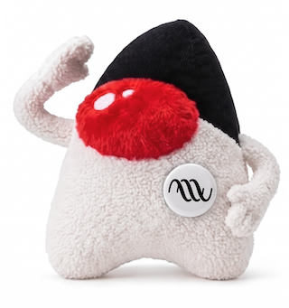

[](https://jitpack.io/#umjammer/vavi-sound-alac)
[](https://github.com/umjammer/vavi-sound-alac/actions/workflows/maven.yml)
[](https://github.com/umjammer/vavi-sound-alac/actions/workflows/codeql-analysis.yml)

[](https://github.com/umjammer/vavi-sound-sandbox)

# vavi-sound-alac



 Pure Java Apple Lossless decoder

it works as `javax.sound.sampled.spi`</br>
this project is a fork of [soiaf/Java-Apple-Lossless-decoder](https://github.com/soiaf/Java-Apple-Lossless-decoder)

## Install

https://jitpack.io/#umjammer/vavi-sound-alac

## Usage

```java
var alacAis = AudioSystem.getAudioInputStream(new BufferedInputStream(Files.newInputStream(alac)));
var inFormat = sourceAis.getFormat();
var outFormat = new AudioFormat(44100, 16, 2, true, false);
var pcmAis = AudioSystem.getAudioInputStream(outFormat, alacAis);
var line = (SourceDataLine) AudioSystem.getLine(new DataLine.Info(SourceDataLine.class, pcmAis.getFormat()));
line.open(pcmAis.getFormat());
line.start();
var buffer = new byte[line.getBufferSize()];
int bytesRead;
while ((bytesRead = pcmAis.read(buffer)) != -1) {
  line.write(buffer, 0, bytesRead);
}
line.drain();
```

### jvm args

```
--add-opens java.base/java.io=ALL-UNNAMED
--add-opens java.base/sun.nio.ch=ALL-UNNAMED
```


## References

 * https://github.com/flacon/alacenc

## TODO

 * play clip w/o format conversion (possible?)

---

<sub>image designed by @umjammer, drawn by nano banana</sub>
